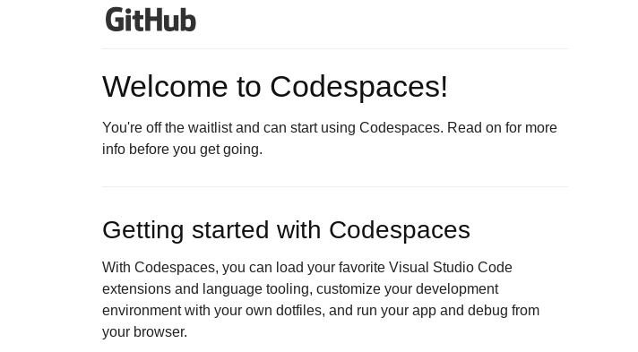
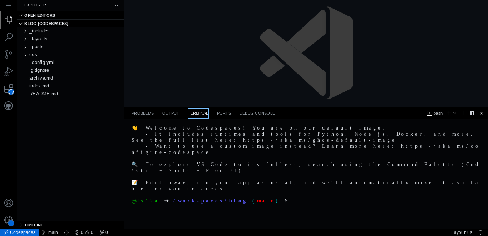
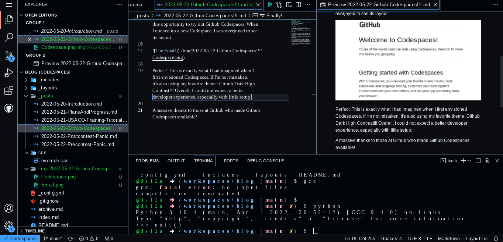

## Finally!

It was when I expected it the least. I had forgotten that I had signed up for Codespaces beta until I recieved *the email*.

I love VS Code.  As a result, I could not pass up this opportunity to try out Github Codespaces. When I opened up a new Codespace, I was overjoyed to see its layout:

Perfect! This is exactly what I had imagined when I first envisioned Codespaces. If I'm not mistaken, it's also using my favorite theme: Github Dark High Contrast!!! The upload feature makes it easy to add files to repos and greatly sped up the writing of this post. Overall, I could not expect a better developer experience, especially with little setup. The upload feature makes it easy to add files to repos and greatly sped up the writing of this post. 

A massive thanks to those at Github who made Github Codespaces available!